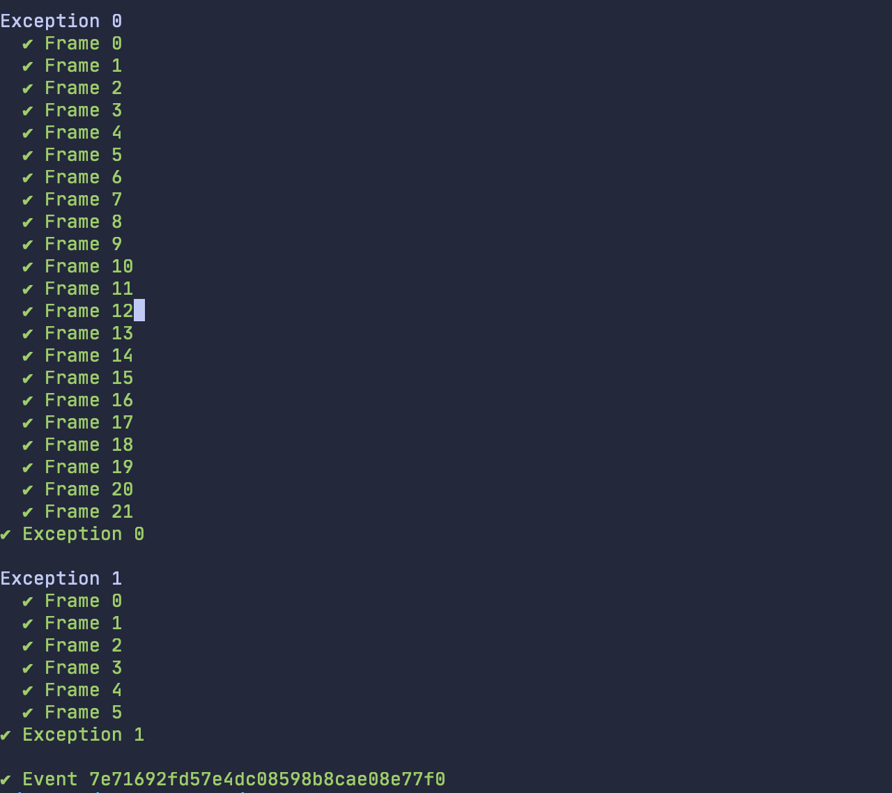
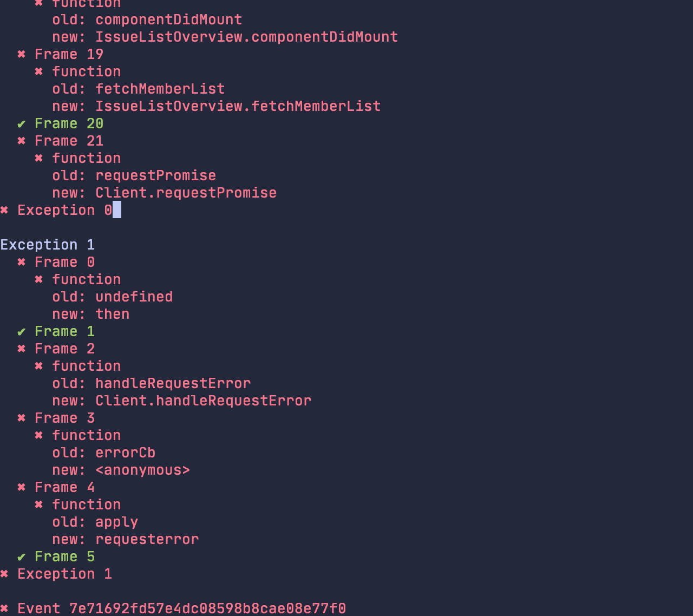

# js-processing-diff

Generate diffs for manual SourceMapCache processing A/B tests.

Install dependencies:
```
$ npm install
```

Configure API Token, Organization and Project:

Either via ENV variables:
```
process.env.SENTRY_TOKEN=""
process.env.SENTRY_ORGANIZATION=""
process.env.SENTRY_PROJECT=""
```

or through `config.json` file (see `config.sample.json`).

---

To diff specific event:
```
$ node app.js <eventid>
```

To diff latest N events:
```
$ node app.js <count>
```



